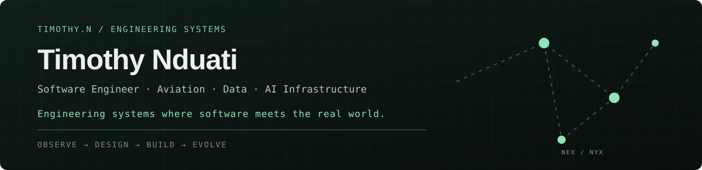

<div align="center">



<samp>Software Engineer → Data Engineer · Financial Systems · AI Infrastructure</samp>

[website](https://timothynn.dev) · [linkedin](https://linkedin.com/in/timothynn) · [x](https://twitter.com/timothynn_)

</div>

---

<details open>
<summary><b>currently</b></summary>

Building systems where **data, software, and intelligent tooling** meet.

Current threads:

- **Nexus** — programmable AI runtime / developer harness
- **Market systems** — ingestion, processing, modeling, and quantitative research
- **Data engineering** — streaming, ETL/ELT, warehousing, and platform foundations
- **Linux / NixOS** — reproducible environments and developer infrastructure

</details>

<details>
<summary><b>selected work</b></summary>

| project | focus |
| --- | --- |
| [Nexus](https://github.com/timothynn/Nexus) | Agent runtime, tools, permissions, sessions, worktrees, MCP, plugins |
| [nse-quant](https://github.com/timothynn/nse-quant) | Quantitative analysis and market research |
| [market-data-infra](https://github.com/timothynn/market-data-infra) | Financial market-data infrastructure |
| [warehouse-neuron](https://github.com/timothynn/warehouse-neuron) | Event-driven warehouse and inventory systems |
| [financial-risk-prediction](https://github.com/timothynn/financial-risk-prediction) | Predictive financial risk systems |
| [KenyaInventoryPredictorAI](https://github.com/timothynn/KenyaInventoryPredictorAI) | Inventory forecasting and applied ML |

</details>

<details>
<summary><b>stack</b></summary>

**Data** · Python · SQL · Scala · Spark · Kafka · Airflow · PostgreSQL · Redis  
**Systems** · Linux · NixOS · Docker · Git · CI/CD · APIs · event-driven architecture  
**AI** · agent runtimes · tool orchestration · MCP · skills · plugins · local-first workflows  
**Finance** · market data · quantitative research · risk modeling · financial data systems

</details>

<details>
<summary><b>principles</b></summary>

```text
observe  →  understand  →  design  →  build  →  measure  →  evolve
```

> Build more than consume.
>
> Understand systems before trying to optimize them.
>
> Turn failures into data.

</details>

<details>
<summary><b>github</b></summary>

<p align="center">
  
  
</p>

</details>

---

<div align="center">
<samp>🐺 NYX · BUILD. SOLVE. EVOLVE.</samp>
</div>
