<div align="center">

```ascii
╔═══════════════════════════════════════════════════════════════════════════════╗
║                                                                               ║
║                       ███╗   ██╗██████╗ ██╗   ██╗ █████╗ ████████╗██╗         ║
║                       ████╗  ██║██╔══██╗██║   ██║██╔══██╗╚══██╔══╝██║         ║
║                       ██╔██╗ ██║██║  ██║██║   ██║███████║   ██║   ██║         ║
║                       ██║╚██╗██║██║  ██║██║   ██║██╔══██║   ██║   ██║         ║
║                       ██║ ╚████║██████╔╝╚██████╔╝██║  ██║   ██║   ██║         ║
║                       ╚═╝  ╚═══╝╚═════╝  ╚═════╝ ╚═╝  ╚═╝   ╚═╝   ╚═╝         ║
║                                                                               ║
║                              ═══ THE GREAT ═══                                ║
║                                                                               ║
║                        Timothy Nduati • @timothynn                            ║
║                                                                               ║
╚═══════════════════════════════════════════════════════════════════════════════╝
```
</div>

<div align="center">

**CS Grad • Azure Certified Data Scientist • Software Engineer → Data Engineer**

*Building the bridge between code and insights*

</div>

---

## 🎯 The Journey

From writing algorithms to architecting data flows. From debugging code to debugging insights. 

I'm on a mission to transform how organizations leverage their data—combining software engineering rigor with data science intuition to build systems that don't just work, but scale.

**Current Chapter:** Transitioning from software engineering into data engineering, bringing battle-tested engineering practices to the data world.

---

## 🧰 Arsenal

<table>
<tr>
<td width="50%" valign="top">

### 🔬 Data Science
```python
skills = {
    'ml_frameworks': ['scikit-learn', 'tensorflow', 'pytorch'],
    'cloud_ml': ['Azure ML Studio', 'Azure Cognitive Services'],
    'analysis': ['pandas', 'numpy', 'scipy'],
    'visualization': ['matplotlib', 'seaborn', 'plotly'],
    'bi_tools': ['Power BI', 'Tableau']
}
```

**Certified:** Microsoft Azure Data Scientist Associate

</td>
<td width="50%" valign="top">

### ⚙️ Data Engineering
```python
toolkit = {
    'orchestration': ['Airflow', 'Azure Data Factory'],
    'processing': ['Spark', 'Kafka', 'dbt'],
    'storage': ['PostgreSQL', 'Azure SQL', 'Cosmos DB'],
    'cloud': ['Azure', 'AWS', 'GCP'],
    'streaming': ['Kafka', 'Azure Event Hubs']
}
```

**Learning:** Modern data stack, real-time pipelines

</td>
</tr>
<tr>
<td width="50%" valign="top">

### 💻 Software Engineering
```python
foundation = {
    'languages': ['Python', 'Java', 'C++', 'JavaScript'],
    'paradigms': ['OOP', 'Functional', 'Concurrent'],
    'practices': ['TDD', 'CI/CD', 'Code Review'],
    'tools': ['Git', 'Docker', 'Kubernetes']
}
```

**Philosophy:** Clean code, scalable systems

</td>
<td width="50%" valign="top">

### 🛠️ DevOps & Infrastructure
```python
automation = {
    'containers': ['Docker', 'Kubernetes'],
    'cicd': ['GitHub Actions', 'Azure DevOps'],
    'monitoring': ['Prometheus', 'Grafana'],
    'iac': ['Terraform', 'ARM Templates']
}
```

**Focus:** MLOps, DataOps, automation

</td>
</tr>
</table>

---

## 💭 Philosophy

> **Code is temporary. Data systems are forever.**
> 
> Good data engineering isn't just about moving data from A to B—it's about building resilient, self-healing systems that handle chaos gracefully. It's software engineering principles applied to the messiest resource we have: real-world data.

**My Principles:**
- 🎯 **Quality over speed** → But never sacrifice both
- 🔄 **Automate everything** → Including the automation
- 📊 **Data tells stories** → Make sure they're true
- 🧪 **Test in production** → Just kidding. Test before production.
- 🚀 **Ship iteratively** → Perfect is the enemy of shipped

---

## 🎨 Currently Crafting

- 🏗️ Building a real-time data pipeline for streaming analytics
- 📚 Deep diving into distributed systems and data modeling
- 🤖 Implementing MLOps practices for production ML systems
- 🌱 Contributing to open-source data tools
- 📝 Writing about lessons learned in data engineering

---

## 📊 By The Numbers

<div align="center">


</div>

---

## 🤝 Let's Connect

I'm always interested in discussing data architecture, ML systems, or how to make data pipelines that don't keep you up at night.

<div align="center">

[](https://linkedin.com/in/timothynn)
[](https://twitter.com/timothynn_)
[](https://mastodon.social/@timothynn)
[](https://matrix.to/#/@timothynn:matrix.org)
[](mailto:timothynn08@gmail.com)

</div>

---

## 🎓 Learning Path

<div align="center">



```mermaid
graph LR
    A[Software Engineering] --> B[Data Science]
    B --> C[Machine Learning]
    C --> D[Data Engineering]
    D --> E[Distributed Systems]
    
    style A fill:#0D1117,stroke:#58A6FF,stroke-width:2px
    style B fill:#0D1117,stroke:#58A6FF,stroke-width:2px
    style C fill:#0D1117,stroke:#58A6FF,stroke-width:3px
    style D fill:#0D1117,stroke:#F97316,stroke-width:3px
    style E fill:#0D1117,stroke:#F97316,stroke-width:2px
```

**Current Focus:** Data Engineering & Distributed Systems  
**Next Up:** Stream Processing & Real-time Analytics

</div>

---

## 💡 Featured Projects

<div align="center">

| Project | Description | Tech Stack |
|---------|-------------|------------|
| 🐧 **[Palmer Penguins Clustering](https://github.com/timothynn/Palmer-Penguins-Clustering)** | ML clustering analysis on penguin species data | Python, Scikit-learn, Pandas |
| 🔄 **Data Pipeline Framework** | ETL framework for automated data ingestion | Python, Airflow, Azure |
| 📊 **Real-time Analytics Dashboard** | Live data visualization platform | Python, Kafka, Power BI |

*More projects coming soon...*

</div>

---

<div align="center">

*"The best time to start building data systems was yesterday. The second best time is now."*

**[⬆ back to top](#)**

</div>
